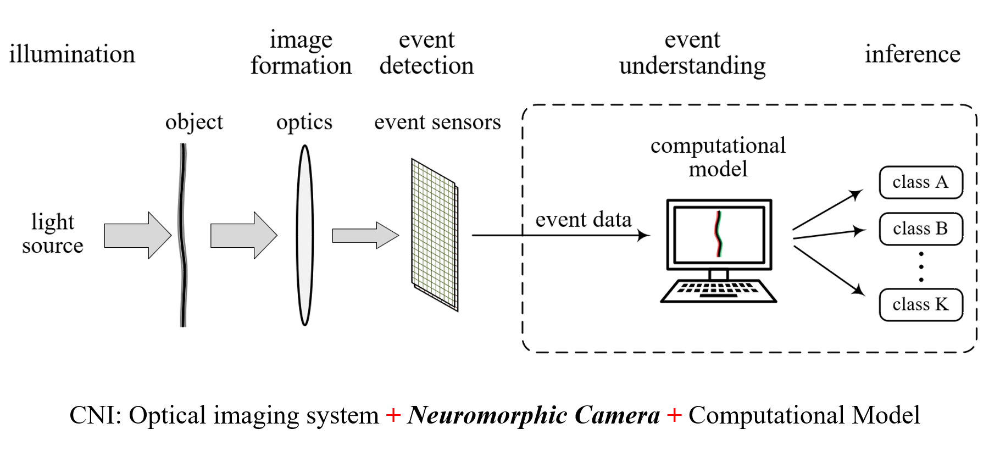
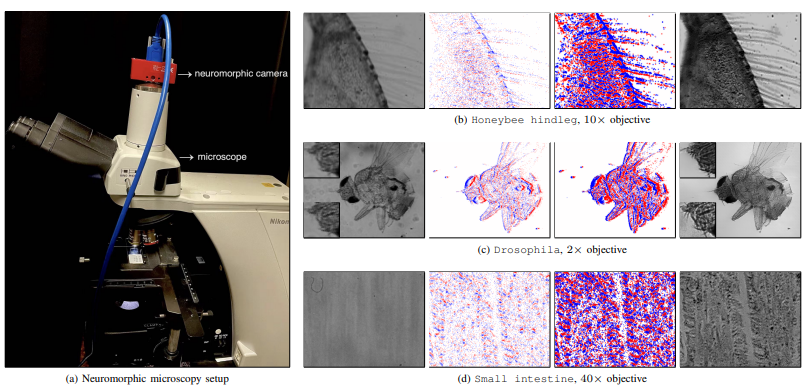

<h2 class="section-title">Computational neuromorphic imaging

<em>A new paradigm to shape conventional optical imaging</em>

</h2>

<a href="https://en.wikipedia.org/wiki/Differentiable_imaging" target="_blank" rel="noopener">
	<!--  -->
</a>

 
<nav class="text-center" style="width: 100%; font-size:1.2em;">
📄 <b><a href="https://www.spiedigitallibrary.org/conference-proceedings-of-spie/12857/1285703/Computational-neuromorphic-imaging-principles-and-applications/10.1117/12.3012192.short">Computational neuromorphic imaging: principles and applications</a></b>, <em>Computational Optical Imaging and Artificial Intelligence in Biomedical Sciences, volume 12857 of Proceedings of the SPIE, pp. 1285703</em>, January 2024</nav>

<nav class="text-center">
  <a href="https://scholar.google.com.hk/citations?view_op=list_works&hl=en&hl=en&user=uR0gBNcAAAAJ">Shuo Zhu</a>1, 
  <a href="https://scholar.google.com.hk/citations?hl=en&user=YrNzoXgAAAAJ">Chutian Wang</a>1, 
  <a href="https://scholar.google.com.hk/citations?user=cWDMPtsAAAAJ&hl=en">Haosen Liu</a>1, 
  <a href="https://scholar.google.com.hk/citations?user=Haaxgp0AAAAJ&hl=en">Pei Zhang</a>1, 
  <a href="https://www.eee.hku.hk/~elam">Edmund Y. Lam</a>1
</nav>

  
1The University of Hong Kong

## Abstract

Computational neuromorphic imaging (CNI), which integrates event cameras, optics, and computational models, represents a promising frontier in optical imaging. The CNI technique makes use of event sensors that encompass time-efficient imaging, high dynamic range reconstruction, and high-sensitivity sensing, and is ideally suitable for detecting ultrafast dynamic information and is robust to challenging environments. CNI encompasses ultrafast dynamic analysis, high-sensitivity sensing, and energy efficiency, offering the transformative potential for academic research and industrial applications from micro to macro settings.

## Introduction

<!-- |  |
| :----------------------------------------------------------: |
| A generic computational neuromorphic imaging system. | -->

|  |
| :----------------------------------------------------------: |
| A generic computational neuromorphic imaging system. | 

## Technical Framework

|  |
| :----------------------------------------------------------: |
| (a) Neuromorphic microscopy system. (b)–(d) From left to right: raw image, raw LR events, SR events, and reconstructed image.  

Neuromorphic imaging is an emerging technique that imitates the human retina to sense variations in dynamic scenes. It responds to pixel-level brightness changes by asynchronous streaming events and boasts microsecond temporal precision over a high dynamic range, yielding blur-free recordings under extreme illumination. Nevertheless, this modality falls short in spatial resolution and leads to a low level of visual richness and clarity. Pursuing hardware upgrades is expensive and might cause compromised performance due to more burdens on computational requirements. Another option is to harness offline, plug-in-play super-resolution solutions. However, existing ones, which demand substantial sample volumes for lengthy training on massive computing resources, are largely restricted by real data availability owing to the current imperfect highresolution devices, as well as the randomness and variability of motion. To tackle these challenges, we introduce the first selfsupervised neuromorphic super-resolution prototype[^1]. It can be self-adaptive to per input source from any low-resolution camera to estimate an optimal, high-resolution counterpart of any scale, without the need of side knowledge and prior training.

## Research Achievements

| **URL:** [**Collobration with Prophesee:**  ](https://www.prophesee.ai/2025/02/20/neuromorphic-imaging-with-super-resolution/) |

## Related Publications
[^1]: Zhang P, Zhu S, Wang C, Zhao Y, Lam EY, "[ Neuromorphic imaging with super-resolution](https://ieeexplore.ieee.org/abstract/document/10720845/),"  IEEE Transactions on Circuits and Systems for Video Technology. 2024 Oct 17;35(2):1715-27.

[^2]: Ni Chen, David J. Brady, Edmund Y. Lam, "[Differentiable Imaging: progress, challenges, and outlook](https://spj.science.org/doi/10.34133/adi.0117)," Advanced Devices & Instrumentation, 2025.

[^3]: Ni Chen, Yang Wu, Chao Tan, Liangcai Cao, Jun Wang, Edmund Y. Lam, "[Uncertainty-Aware Fourier Ptychography](https://doi.org/10.1038/s41377-025-01915-w)," Light: Science & Applications, 2025.

[^4]: Ni Chen, Edmund Y. Lam, "[Differentiable pixel-super-resolution lensless imaging](https://doi.org/10.1364/OL.552086)," Optics Letters, 2025.

[^5]: Yang Wu, Jun Wang, Sigurdur Thoroddsen, Ni Chen*, "[Single-Shot High-Density Volumetric Particle Imaging Enabled by Differentiable Holography](https://ieeexplore.ieee.org/abstract/document/10660564)," IEEE Transactions on Industrial Informatics, 2024.

[^6]: Ni Chen, Congli Wang, Wolfgang Heidrich, "[∂H: Differentiable Holography](https://onlinelibrary.wiley.com/doi/abs/10.1002/lpor.202200828)," Laser & Photonics Reviews, 2023.
